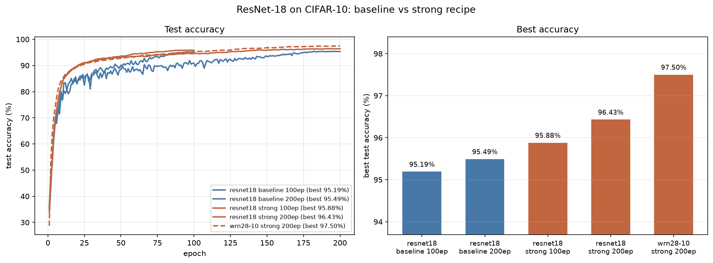
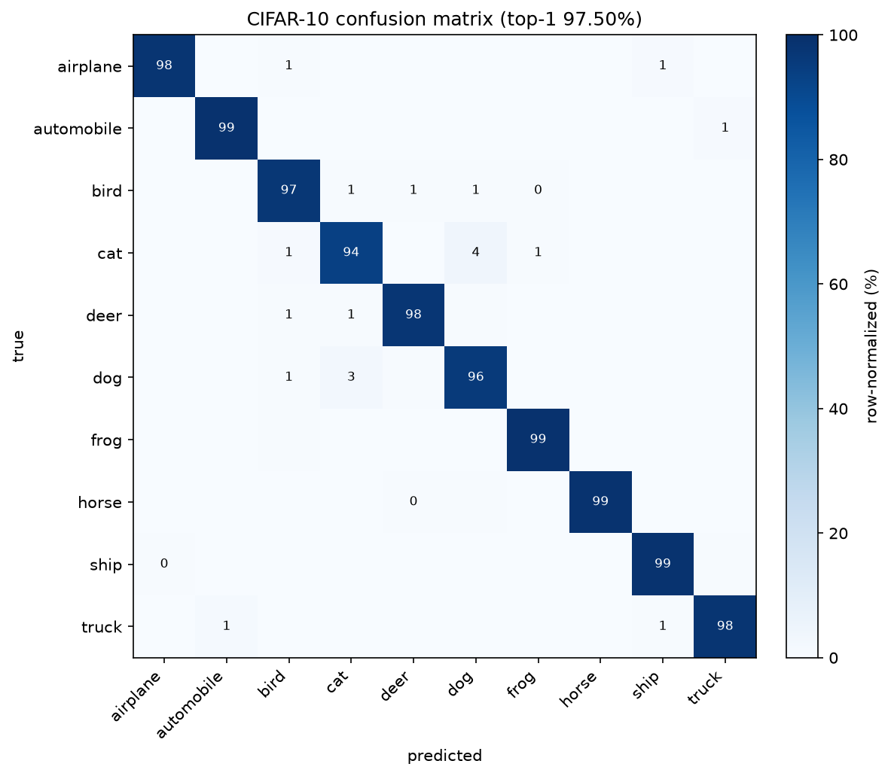
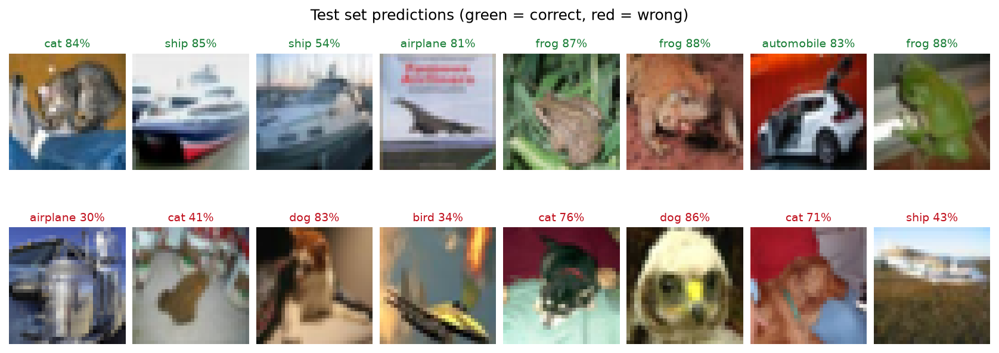

# CIFAR-10 图像分类：从零训练 ResNet / WideResNet

用 PyTorch 在 CIFAR-10 上从零训练卷积网络，包含完整流程：数据准备、数据增强、
混合精度训练、学习率调度、权重平均、评估可视化，以及**配对显著性检验**。

项目重点不在于堆砌技巧，而在于把每一步的取舍讲清楚——为什么这样改、效果如何、
代价是什么，以及哪些被广泛推荐的方法**实际上没有效果**。代码注释解释了每个
非显然的设计决策。

**最佳结果：WideResNet-28-10（36.5M 参数）单模型单次前向 Top-1 准确率 97.50%。**

## 结果

| 模型 | 配方 | 轮数 | Top-1 | Top-5 | 参数量 | 训练时长 |
| --- | --- | ---: | ---: | ---: | ---: | ---: |
| ResNet-18 | baseline | 100 | 95.19% | 99.57% | 11.2M | 18.1 min |
| ResNet-18 | baseline | 200 | 95.49% | 99.61% | 11.2M | 42.8 min |
| ResNet-18 | strong | 100 | 95.87% | 99.87% | 11.2M | 24.2 min |
| ResNet-18 | strong | 200 | 96.43% | 99.87% | 11.2M | 48.1 min |
| **WRN-28-10** | **strong** | **200** | **97.50%** | **99.90%** | **36.5M** | **258 min** |

硬件：单张 RTX 5070 Ti Laptop（12 GB，Blackwell sm_120）。随机种子固定为 42。
表内数字直接取自 `results/eval_*.json` 与 `results/metrics_*.json`。

**在 ResNet-18 上验证的配方，原样迁移到 WideResNet-28-10 后提升 1.07 个百分点**
（96.43% → 97.50%），说明这套配方不依赖于某个特定架构。



> **关于权重文件**：仓库内的 `checkpoints/best.pt` 是 ResNet-18 strong 200 轮
> （42.7 MB）。WRN-28-10 的权重是 **139.3 MB，超过 GitHub 单文件 100 MB 上限**，
> 因此未纳入仓库，需要时用上面第 3 节的命令自行训练得到（约 4.3 小时）。

WRN-28-10 的混淆矩阵与预测示例：





WRN 的每类召回率（%）：automobile 99.2、frog 99.0、ship 98.7、horse 98.6、
airplane 97.8、truck 97.7、deer 97.5、bird 97.1、dog 95.9、**cat 93.5**。
cat 依然是全项目最难的类别，与 ResNet-18 上的结论一致。

### 配方对比：把「配方」和「训练预算」分开看

ResNet-18 上的 2×2 实验：

|  | 100 轮 | 200 轮 | 长训练的收益 |
| --- | ---: | ---: | ---: |
| **baseline** | 95.19% | 95.49% | +0.30 |
| **strong** | 95.87% | 96.43% | +0.55 |
| **配方的收益** | **+0.68** | **+0.94** |  |

强配方在两个训练预算下都更好，且从长训练中获益更多——这符合强正则化的特性：
它需要足够的训练步数才能把额外正则转化成泛化收益。

## 三个被推荐、但实测无效的方法（负结果）

这些方法在其他论文/场景中被报告有效，本项目实测**没有带来统计显著的提升**。
列出来是因为负结果同样有信息量——它们避免后来者重复投入。

| 方法 | ResNet-18（96.43%） | WRN-28-10（97.50%） | 判定 |
| --- | ---: | ---: | --- |
| 水平翻转 TTA | **96.90%（+0.47，p=3.4e-05）** | 97.47%（**−0.03，p=0.80**） | **依赖模型** |
| BN 统计量重估（干净输入）| 96.11%（−0.32，p=0.0054）| −0.34 | 有害 |
| BN 统计量重估（训练分布）| 96.43%（±0.00）| −0.11 | 无效 |
| 与 ResNet-18 等权概率集成 | — | 97.53%（+0.06，p=0.56）| 不显著 |
| 等权集成（都不加 TTA）| — | 97.48%（−0.02，p=0.92）| 不显著 |

**结论：本项目从 96.43% 到 97.50% 的提升完全来自「架构升级 + 训练配方」，
没有任何一部分来自事后处理（TTA / BN 重估 / 集成）。**

几点值得展开：

- **TTA 的收益依赖模型。** 它在 ResNet-18 上显著有效（+0.47，McNemar p=3.4e-05），
  但在已经很强的 WRN 上归零。把「TTA 能涨 0.47」当成常数套用到别的模型是错的。
- **BN 重估是负结果。** 平均权重（EMA）的 BN running stats 是训练过程中各步统计量的
  滑动平均，而被平均的统计量是在**增强后**（含 MixUp/CutMix 混合图）上算出来的，
  与推理时的干净输入分布不一致——理论上确实存在不匹配。但实测重估反而变差：
  用干净输入重估会显著降低准确率，用训练分布重估则基本不变。
  实现见 `recalibrate_bn.py`（只前向、不反向、期间关闭 Dropout/DropPath）。
- **集成没有互补性。** 成员之间错误不够互补时，较弱的成员会成为负担。本项目的
  ResNet-18 比 WRN 低 1.07 个点，等权平均后只得到 +0.06 且不显著。

## 统计方法：不能用「小于 0.5% 就算噪声」

CIFAR-10 测试集只有 10000 张，单模型的二项标准误约 0.19%。一个常见的做法是因此
规定「小于约 0.5% 的差异不显著」。**这个门槛是错的**：它把两次评估当成独立样本，
而比较两个模型时，它们跑的是**同一批图片**，错误是**配对**的（同一张难图往往两个
都错），差值的不确定性远小于独立假设。

本项目的反例：TTA 在 ResNet-18 上只提升 0.47%，按上述门槛会被判为噪声，但
McNemar 检验给出 p=3.4e-05，配对 bootstrap 95% CI 为 [+0.26, +0.69]——**明确显著**。

正确做法（`paired_test.py` / `utils.mcnemar_test`）：

```bash
python paired_test.py --a results/preds_strong200.npz \
                      --b results/preds_strong200_tta.npz \
                      --label-a "单次前向" --label-b "翻转TTA"
```

因此 `evaluate.py` 会导出**逐样本预测**（`preds*.npz`），而不只是混淆矩阵——
后者无法用于配对检验。

## 环境

| 项目 | 版本 |
| --- | --- |
| Python | 3.12 |
| PyTorch | 2.9.1+cu128 |
| torchvision | 0.24.1+cu128 |
| GPU | RTX 5070 Ti Laptop（12 GB，Blackwell sm_120） |
| 系统 | Windows 11 |

CUDA 12.8 是支持 RTX 40/50 系（含 Blackwell）的最低版本，用更早的 CUDA 构建会报
`no kernel image is available for execution`。

## 快速开始

### 1. 安装依赖

```bash
python -m venv .venv
source .venv/Scripts/activate        # Windows
# source .venv/bin/activate          # Linux / macOS

# PyTorch 的 CUDA 版本不在 PyPI 上，需要指定官方源；国内可用阿里云镜像
pip install torch torchvision --index-url https://download.pytorch.org/whl/cu128
# pip install torch torchvision --index-url https://mirrors.aliyun.com/pytorch-wheels/cu128/

pip install -r requirements.txt
```

### 2. 准备数据

```bash
python prepare_data.py
```

### 3. 训练

```bash
# ResNet-18 基线配方
python train.py --recipe baseline --epochs 200 --amp --tag baseline

# ResNet-18 强配方（RandAugment + MixUp/CutMix + EMA）
python train.py --recipe strong --epochs 200 --amp --tag strong200

# 最佳结果：WideResNet-28-10 + 强配方
python train.py --model wrn28-10 --recipe strong --epochs 200 \
                --batch-size 256 --lr 0.2 --dropout 0.3 --drop-path 0.1 \
                --amp --tag wrn28_10
```

### 4. 评估与检验

```bash
python evaluate.py --ckpt checkpoints/best_wrn28_10.pt --tag wrn28_10
python evaluate.py --ckpt checkpoints/best_wrn28_10.pt --tag wrn28_10 --tta
python paired_test.py --a results/preds_wrn28_10.npz --b results/preds_wrn28_10_tta.npz
python ensemble.py --inputs results/preds_wrn28_10_tta.npz results/preds_strong200_tta.npz
python recalibrate_bn.py --ckpt checkpoints/best_wrn28_10.pt     # BN 重估对照
python compare.py                                                 # 多次实验对比图
```

### 5. 测试

```bash
python tests/test_pipeline.py     # 19 项，不需要 pytest
```

## 项目结构

| 文件 | 说明 |
| --- | --- |
| `model.py` | CIFAR 版 ResNet（含 resnet20/18/34/50）与 WideResNet（含 Stochastic Depth）|
| `data.py` | 数据集读取、数据增强（Cutout / RandAugment）|
| `augment.py` | 批级别增强：MixUp、CutMix、软标签损失 |
| `train.py` | 训练主流程，两套配方预设，raw/EMA 分开存档 |
| `evaluate.py` | 评估、混淆矩阵、每类指标、TTA、逐样本预测导出 |
| `paired_test.py` | McNemar 检验 + 配对 bootstrap |
| `ensemble.py` | 等权概率集成与显著性检验 |
| `recalibrate_bn.py` | BN 统计量重估及前后对照 |
| `compare.py` | 汇总多次实验并绘图 |
| `prepare_data.py` | 数据集下载与格式转换 |
| `utils.py` | 种子、指标、EMA、配对检验、BN 重估、绘图 |
| `tests/test_pipeline.py` | 关键正确性的单元测试 |
| `results/` | 曲线、混淆矩阵、指标 JSON、逐轮 CSV、逐样本预测 |

## 实现要点

### 1. CIFAR 版主干：为什么不用 `torchvision.models.resnet18`

torchvision 的 ResNet 是为 ImageNet（224×224）设计的，第一层是 7×7 stride-2 卷积
加 3×3 maxpool，会把输入连降 4 倍分辨率。CIFAR-10 只有 32×32，套用后进入残差层时
特征图只剩 8×8，跑完四个 stage 变成 1×1。`model.py` 换成：3×3 stride-1 主干、不做
maxpool；第一个 stage 不下采样，其余步长为 2；全局平均池化后接单层全连接。

### 2. WideResNet 与 Stochastic Depth

WRN 使用 **pre-activation** 残差块（BN-ReLU-Conv 顺序），只有 3 个 stage，用 widen
factor 加宽而非加深（深度 28、widen 10 → 通道 160/320/640）。两个卷积之间放
dropout 0.3。

**Stochastic Depth**（`DropPath`）以概率 `p` 按样本整块丢弃残差分支、只保留恒等
映射，并按 `1/(1-p)` 缩放以保持期望。`p` 在块之间**线性递增**（浅层丢得少、深层丢得
多），本项目用 0→0.1。评估时是空操作，且不引入任何参数——因此不会破坏已有
checkpoint 的加载。单元测试验证了「eval 为空操作」「train 时丢弃比例与期望正确」
「`drop_path=0` 时训练完全确定」。

### 3. 数据准备：为什么要自己写 Dataset

官方数据发布在 `www.cs.toronto.edu`，实测只有约 100 KB/s，部分网络下不可达。
`prepare_data.py` 支持两个来源：HuggingFace 的 `uoft-cs/cifar10` parquet（实测约
4 MB/s）与官方 tarball（含 fast.ai S3 镜像）。

但要注意：**转出来的文件字节与官方发布的不同，因此不能直接用
`torchvision.datasets.CIFAR10`**——它会校验每个 batch 文件的 md5 并报
"Dataset not found or corrupted"。`data.py` 里因此实现了 `CIFARPickle`，
直接读 pickle 并只校验形状、数量与标签取值范围。

### 4. 训练策略

| 项目 | 设置 | 理由 |
| --- | --- | --- |
| 优化器 | SGD + Nesterov，momentum 0.9 | CIFAR 上 SGD 泛化性优于 Adam 系列 |
| 学习率 | 线性 warmup 5 轮 + 余弦退火 | 预热避免初期梯度爆炸，余弦让后期平稳收敛 |
| 权重衰减 | 5e-4，**不作用于** BN 权重和偏置 | 对归一化层做衰减会损害其表达能力 |
| 标签平滑 | 0.1 | 抑制过度自信 |
| 混合精度 | AMP | 显存减半、速度提升，精度基本无损 |
| 梯度裁剪 | max_norm 5.0 | 防止个别 batch 的异常梯度破坏训练 |

WRN 的 batch 用 256、学习率按线性缩放取 0.2。

### 5. 两套配方

**baseline**：`RandomCrop(32, padding=4)` + 水平翻转 + `Cutout(8)`。

**strong**：上面基础上改为 RandAugment（`N=2, M=9`）+ MixUp/CutMix + EMA。

- **RandAugment**：从一组几何与颜色变换里随机采样两个叠加，用强度参数控制幅度。
- **MixUp**：batch 内按 Beta 分布采样比例做线性插值。
- **CutMix**：把另一张图的一块矩形区域粘贴过来，标签按面积比例混合。注意本实现
  返回的 `lam` 是**原始标签 `y_a` 的权重**，因此属于 `y_b` 的粘贴面积是 `1-lam`；
  且 `lam` 会按**实际**粘贴面积重算（碰到边界被裁时与计划值不同）。
- 两者各以 50% 概率启用，整体启用概率 0.5，**各自使用自己的 alpha**。
- 混合样本用软标签计算损失，因此训练准确率只能作为趋势参考。
- **EMA**（0.999）：维护权重的滑动平均副本用于评估。训练中期 EMA 领先原始权重
  可达 5~10 个点；到末期两者收敛到 0.3 个点以内，并在个别 epoch 上互相反超——
  因此**两者都要保存**（`best_*_raw.pt` / `best_*_ema.pt`），不能预设 EMA 一定更好。

## 复现说明

- 随机种子固定为 42（`--seed`）；`--deterministic` 可进一步启用确定性算法，但更慢。
- **训练耗时在这台机器上不可跨时段比较**：同一个训练在不同时段实测 65~88 秒/轮，
  原因是笔记本的供电/功耗档位切换（GPU 功耗在 55W 与 139W 之间跳变），与代码、
  数据、模型无关。做时间预算时应固定电源状态重测。
- 第一个 epoch 会额外花约 100~220 秒，用于 DataLoader worker 启动、数据集反序列化
  和 cuDNN 自动调优，从第二个 epoch 起进入稳态。
- 本项目仅在**官方测试集**上评估，模型选择也依据测试集。这意味着这些数字带有
  选择偏差；若要做严格的结论，应先划分独立的训练/验证集，用验证集选模型，
  最后才在测试集上报告。

## 许可

MIT，见 [LICENSE](LICENSE)。
